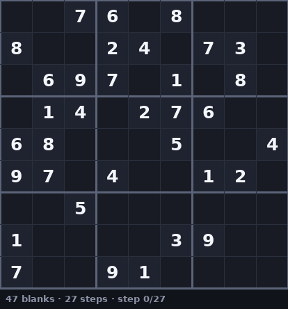
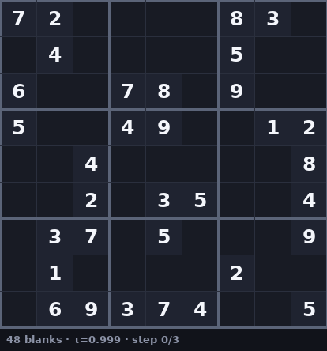

# nonet

A **masked–diffusion Sudoku solver**: a small Diffusion Transformer (DiT) trained as a
discrete denoiser (MDLM-style) that solves Sudoku by iteratively un-masking the most
confident cells, MaskGIT-style.

A puzzle is an 81-token sequence with `0` = empty/`[MASK]` and `1..9` = digits. Training
randomly masks cells of a *solved* board and asks the model to recover them; solving runs
that process in reverse, revealing cells from most- to least-confident until the grid is
full.



*Cells are tinted by the model's confidence (blue = unsure → green = sure); given clues stay
grey. Generate your own with `scripts/render_gif.py`.*

---

## Quickstart

```bash
uv sync                              # install deps into .venv

# watch it solve in the browser — loads the pretrained model from the HF Hub,
# so no training needed
uv run python -m nonet.webapp        # then open http://127.0.0.1:8000

# (optional) train your own small model
uv run python -m nonet.trainer
```

The pretrained weights live on the Hub at
[**tchauffi/sudoku-dit**](https://huggingface.co/tchauffi/sudoku-dit) (1.28 M params) and are
downloaded on demand:

```python
from nonet.hub import load_solver
solver = load_solver()               # -> SudokuSolver, ready to .solve(...)
```

> The training/eval scripts download `Ritvik19/Sudoku-Dataset` (~17M puzzles) via 🤗
> `datasets`. Set `HF_TOKEN` to avoid rate limits.

---

## How it works

- **Forward process** (`schedueler.py`): at diffusion time `t ∈ [0,1]`, each cell is kept
  with probability `alpha(t)` and masked otherwise. `LinearScheduler` uses `alpha = 1 - t`.
- **Denoiser** (`model.py`): `SudokuDiT` embeds each cell (token + 2-D sin-cos position +
  explicit 3×3-box id) and a timestep, then runs adaLN-Zero DiT blocks and predicts a digit
  distribution per cell.
- **Training** (`pipeline.py::SudokuSolver.loss`): mask a solved board, predict the masked
  cells, score them with cross-entropy (per-board mean over masked cells). In *conditional*
  mode the puzzle's given clues are never masked or scored.
- **Solving** (`pipeline.py::SudokuSolver.solve`): start from the puzzle, repeatedly predict
  all cells, and reveal the most-confident still-masked ones, re-conditioning each step.
  Given clues are clamped and never overwritten.

### Components

| File | What it is |
|------|------------|
| `model.py` | `SudokuDiT` — DiT denoiser (token/position/box embeddings, timestep, adaLN-Zero blocks) |
| `schedueler.py` | `LinearScheduler` (default), `CosineScheduler` (experimental) masking schedules |
| `pipeline.py` | `SudokuSolver` — `q_sample`, `loss`, `sample` (random reveal), `solve` (confidence-first decode) |
| `dataset.py` | loads the HF dataset; tokenizes **on the fly** in the DataLoader `collate_fn` |
| `tokenizer.py` | `SudokuTokenizer` — puzzle string → `LongTensor` |
| `sudokuer.py` | `SudokuJudge` — vectorized `is_valid` / `is_solved` checks |
| `trainer.py` | 🤗 `accelerate` training loop (logging, eval, checkpoints) |
| `webapp.py` | zero-dependency stdlib web UI to watch the solve animate |

---

## Training

```bash
uv run python -m nonet.trainer [options]
```

Key options (defaults in brackets):

| Flag | Default | Notes |
|------|---------|-------|
| `--hidden-size` / `--num-heads` / `--num-blocks` | `128 / 4 / 4` | kept **small on purpose** (see findings) |
| `--batch-size` | `256` | |
| `--lr` / `--warmup-steps` | `3e-4 / 200` | short warmup matters (see findings) |
| `--weight-decay` | `1e-3` | light regularization (no dropout used) |
| `--label-smoothing` | `0.0` | leave off — see calibration finding |
| `--max-steps` | `50000` | |
| `--conditional` / `--unconditional` | conditional | keep clues unmasked vs. full generative model |
| `--solve-steps`, `--eval-every`, `--save-every` | `27 / 1000 / 5000` | |

Logs `train/loss`, `train/cell_acc` (every `--log-every`) and eval `cell_acc` / `solved_rate`
to TensorBoard under `runs/`. Checkpoints go to `checkpoints/<run>/sudoku_dit_*.pt`.

---

## Web demo

```bash
uv run python -m nonet.webapp --port 8000           # pretrained model from the HF Hub
uv run python -m nonet.webapp --ckpt path/to.pt     # or a local checkpoint
```

A single self-contained page (Python stdlib server only) that animates the solve:

- **Confidence heatmap** — each filled cell is tinted and labelled by the model's step-0
  certainty (blue = unsure → green = sure); red is reserved for cells that disagree with the
  reference solution.
- **Solving mode** — *confidence (adaptive)*: a **τ slider** *(default 0.999)*, each step
  fills every cell the model is ≥ τ sure of (lower τ = bolder, fewer steps, more mistakes);
  or *iterative (fixed)*: a **steps slider** for a fixed number of reveal steps.
- **"obvious cells first"** — a Sudoku-logic tie-break among equally-confident cells.
- **Difficulty-stratified pool** spanning easy → near-impossible boards, so failures show up.

Useful flags: `--hf-repo` (Hub repo to load), `--ckpt` (local checkpoint instead),
`--pool-size`, `--min-blank` / `--max-blank` (default keeps the full difficulty range).

### Solving programmatically

```python
import torch
from nonet.hub import load_solver

solver = load_solver()                                     # pretrained, from the Hub
puzzle = torch.tensor([[int(c) for c in puzzle_string]])   # (1, 81), 0 = blank
solution = solver.solve(puzzle, conf_threshold=0.999)      # adaptive reveal
# or: solver.solve(puzzle, num_steps=81)                   # fixed schedule
```

### Publishing a model

```bash
uv run hf auth login                                       # write token, once
uv run python scripts/push_to_hf.py --ckpt checkpoints/<run>/sudoku_dit_final.pt \
    --repo <user>/sudoku-dit --num-heads 4
```

Uploads the weights as `model.safetensors`, a `config.json` (carries the dims, incl.
`num_heads`), and a model card.

---

## Performance

A **1.28 M-parameter** model (`hidden=128, heads=4, blocks=4`) trained ~50 k steps, evaluated
on held-out validation puzzles with the default adaptive decoder (**τ = 0.999**).

On a representative random sample (the dataset's natural difficulty mix):

| metric | value |
|--------|-------|
| **valid solutions** (`is_solved`) | **99.8 %** |
| exact match vs. reference | 94.3 % |
| avg. reveal steps / puzzle | **3.6** |
| step-0 confidence calibration (ECE) | ≈ 0.01 |

The `valid` vs `exact` gap is **not** error — it's the dataset's non-uniquely-solvable puzzles,
where the model finds a *different* valid solution (see design notes).

Solve rate by difficulty (and how many steps the adaptive decoder spends):

| blanks | valid | avg steps |
|-------:|------:|----------:|
| ≤ 39 | 100 % | 1–2 |
| 40–49 | 99.7 % | 3.4 |
| 50–59 | 98.2 % | 7.0 |
| 60–69 | ~98 % | ~49 |

Easy boards clear in **one step**; the adaptive decoder only spends many steps on the hard
tail. A fixed schedule needs all 81 steps to match this on hard puzzles (~8× more compute) —
see the adaptive-reveal note below.



---

## What we learned (design notes)

Findings from experiments on this dataset/model — they explain the non-obvious defaults.

**Metrics.** Three different things, easy to confuse:
- `cell_acc` — fraction of blank cells matching the reference. High even when solving fails
  (one wrong cell ruins a board), so it's a **misleading** headline.
- `valid_sudoku` (`SudokuJudge.is_solved`) — the board is a complete legal grid. The fair
  success metric.
- `exact_match` — matches the dataset's reference solution. **Stricter than fair**: this
  dataset's high-blank puzzles aren't all uniquely solvable, so the model often produces a
  *different valid* solution. `exact_match ⟹ valid_sudoku`, so `valid ≥ exact` always and the
  gap ≈ the non-unique-puzzle rate (~3.5% in the 30–50 blank band).

**Training dynamics.** The loss sits at the entropy floor (`≈ log 9 ≈ 2.1`, `cell_acc ≈ 0.11`)
for a long plateau, then breaks through in a sharp phase transition. **The plateau length
grows fast with model size** (64-dim ≈ 1.2k steps, 128-dim ≈ 1.4k, 256-dim ≈ 7.2k, the old
512/12 ≈ tens of thousands). Hence the small default and short (200-step) warmup — a long
warmup keeps the LR tiny through exactly the window where the model needs to escape.

**Dataset loading.** `datasets.map()` over ~17M puzzles is prohibitively slow/large, so
tokenization happens **lazily in the DataLoader `collate_fn`** instead (`dataset.py`).

**Inference steps matter a lot — on hard puzzles.** More reveal steps re-condition more
often (iterative constraint propagation). Easy boards solve at any step count; the hard band
(50+ blanks) goes from ~0% valid at 1 step to ~98% at 81. `cell_acc` barely moves throughout.

**Adaptive reveal beats a fixed schedule.** Revealing every cell above a confidence τ
(`solve(conf_threshold=τ)`) instead of a fixed count **matches the 81-step accuracy
(valid 0.99, hard 0.98) at ~9 average steps — ~8× less compute** — because it spends steps
only where the board is hard. This is the web UI's default (τ = 0.999).

**Schedule: linear > cosine.** Cosine (the image-diffusion default) spends its budget at low
mask ratios, but Sudoku's hard reasoning is at *high* mask ratios, so it loses on hard
puzzles. Uniform mask-coverage (linear) wins as both a training and decode schedule. `solve()`
derives its per-step unmask count from `scheduler.alpha`, so the schedule actually drives
decoding (the linear scheduler reproduces the original linear reveal counts).

**Calibration / regularization.** The model is already well-calibrated (ECE ≈ 0.006–0.014,
confidence ≈ accuracy at every training length) — its high certainty is mostly *correct*.
`label_smoothing` only pushes it into under-confidence with no accuracy gain, so it's left at
`0.0`. **Dropout is not used**: training is a ~17M-puzzle stream seen ~once with a tiny model
(no overfitting), and the random masking is already strong augmentation; `weight_decay=1e-3`
is the only regularizer.

---

## Project layout

```
src/nonet/
  model.py        SudokuDiT denoiser
  schedueler.py   masking schedules (Linear / Cosine)
  pipeline.py     SudokuSolver: q_sample / loss / sample / solve
  dataset.py      HF dataset + on-the-fly tokenization
  tokenizer.py    SudokuTokenizer
  sudokuer.py     SudokuJudge (validity / solved checks)
  trainer.py      training loop (accelerate)
  webapp.py       browser demo
  tests/          unit tests (e.g. the judge)
```
